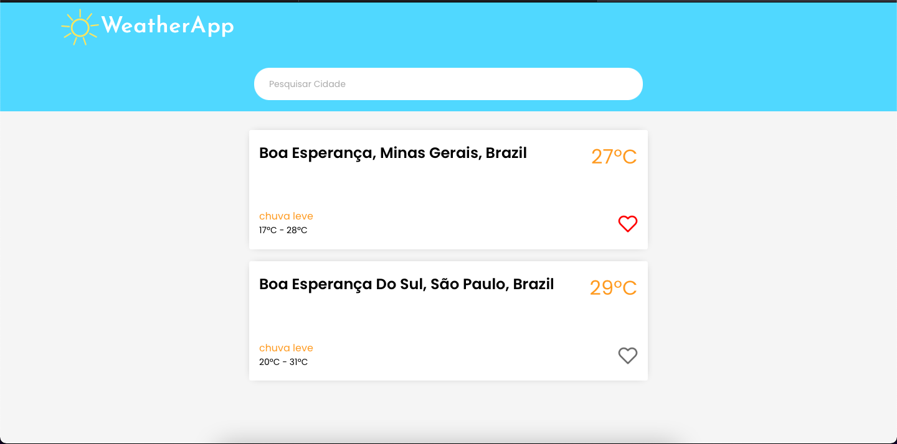

<h2  align="center">

</h2>

## 💻 Projeto
  

Este projeto é uma aplicação NextJS com typescript que consiste em buscar e adicionar cidades para que você as tenha e acompanhe o clima, sendo possivel favoritar para melhor ordenação. 
  

Made with 💜 by <a  href="https://github.com/sararchh"  target="_blank">Sara Rocha </a>
